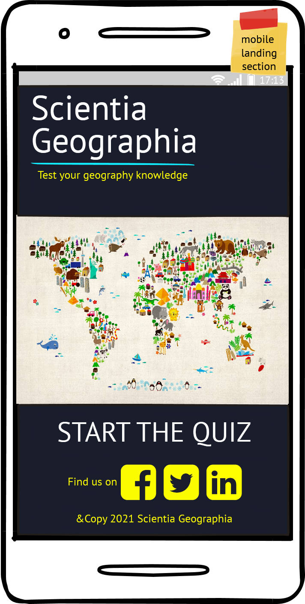
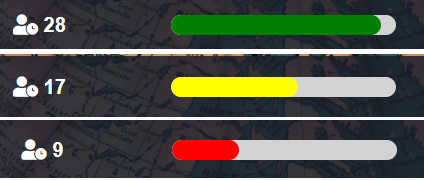
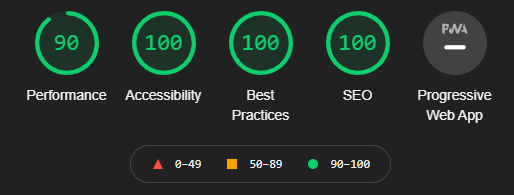

# **SCIENTIA geographia**

Welcome to **SCIENTIA geographia**. A website developed to Test your Geography knowledge.

 

# Table of Contents
- [UX Design](#ux-design)
  - [Audience](#audience)
  - [Site Design and User Stories](#site-design-and-user-stories)
  - [Wireframing](#wireframing)
  - [Color Scheme and Accessibility](#color-scheme-and-accessibility)
  - [Code Reusability and Site Layout](#code-reusability-and-site-layout)
- [Existing Features](#existing-features)
 - [One Page Site and Future Implementations](#one-page-site-and-future-implementations)
 - [Header and Background](#header-and-background)
 - [Footer](#footer)
 - [Landing Section](#landing-section)
 - [Name Section](#name-section)
 - [Quiz Section](#quiz-section)
    - [Quiz Info Bar](#quiz-info-bar)
    - [Upgrade](#upgrade)
    - [Questions & Answers](#questions-and-answers)
    - [Score Tracker](#score-tracker)
  - [Results Section](#results-section)
- [Testing](#testing)
  - [Fixed Bugs](#fixed-bugs)
  - [Unfixed Bugs](#unfixed-bugs)
  - [Browsers](#browsers)
  - [Validator Testing](#validator-testing)
    - [HTML](#html)
    - [CSS](#css)
    - [Javascript](#javascript)
    - [Lighthouse](#lighthouse)
- [Deployment](#deployment)
  - [Local Deployment](#local-deployment)
- [Credits](#credits)
  - [Media and Content](#media-and-content)

# UX Design
The site is a fun but challenging quiz.
## Audience
It is target audience is assumed to have a good level of general knowledge or have studied geography as part of their academics.

## Site Design and User Stories
The site's design is informed by the *users stories* and aims to provide:
- An elegant yet simple and intuitive inteface
- A place to input a name to tailor their unique results
- Be able to discern what question they are on
- Have visual cue as to how much time is left to answer the current question
- Use a simple mouse click to select the answer to each question
- Provide the option to change their mind before moving to the next question
- Get feedback *during* the quiz on how they answered the previous questions
- At the end of the quiz to get a bespoke message on how they performed
- Have the option to play again
- Have a means of viewing the developer's other work and contacting them via LinkedIn

## Wireframing
[Wireframes](docs/wireframes) were created using Balsamiq desktop.





As the project developed other features were added to realise functionality. These included: 
- A call to action button to begin the quiz
- A name input section before the first question
- A replay button in the results section to easily navigate to the beginning of the page

## Color Scheme and Accessibility

The *color scheme* was derived from a piece of fabric passed through [Adobe Color](https://color.adobe.com/create/image-gradient)


To meet WCAG 2.0 criteria, the generated color scheme was then passed to [eightshapes.com](http://www.eightshapes.com) to generate an [*accessibility table*](docs/readme/color-contrast-grid.png "Color Accessibilty Table").


## Code Reusability and Site Layout
Extensive use was made off flexbox to position elements and were possible classes within the html were used to inject most of the CSS styles into the page.
This reduced the size and complexity of the CSS used.

```html
<section id="quiz" class="flex-column flex-center rounded-border max-width">
</section>
```

```css
.rounded-border {
border-radius: 10px;
}
```

# Existing Features

## One Page Site and Future Implementations
For ease, the site is limited to one page as this is my first time using Javascript (JS) within the DOM.  Given current limitations, I was still able to activate the page by showing/hiding different sections by adding event listeners to specific elements.
This gives the appearance of the site being more complex than it actually is.

```js
function startNewGame() {
  landingSection.style.display = "none";
  newGameSection.style.display = "inline-flex";
  playerName.focus();
}

playQuizButton.addEventListener("click", startNewGame);
```

Further development implementations could be: 
- A leaderboard
- An option for the user to change the site color scheme. JS can easily do this by adding/removing classes on targeted elements.
- A facility to print a certificate

## Header and Background


The site follows a simple one page design therefore an anchor tag isn't required on the [header](docs/readme/header.png "Header section").

Also, no menus are needed as navigation is achieved using JS.

An alpha value of 0.85 is used to help blend the heading into the [*background*](docs/readme/background.png "Background Image") image attached to the body.  An old fashioned globe implicitly tells the user the site is geography based.

Note the use of Latin and two contrasting font styles, one modern and the other cursive.  This is to convey that Geography is a modern science grounded in knowledge built up over millennia.

## Footer


The [*footer's*](docs/readme/footer.png "Footer section") purpose is to provide access to the developers Github repos and LinkedIn profile via the favicon links.  These open in new tabs.
Their goal is to allow potential employers and other students to review or use the code to assist in their own projects. 

## Landing Section
This section is a launch point for the user and is minimalist by design.  The call to action button acts as a signpost to begin the quiz.


## Name Section
The name section has a few useful features:
- Autofocus on the name input element to save the user having to manually select.  This is expecially useful on mobile devices. The blinking cursor shows the application
is ready for input.
- Two buttons to either start or leave quiz and return to landing section. This gives the user added control before beginning the game.
- An additional event listener on the input element for pressing enter on a keyboard or Go on a mobile device keypad.  This has the same result as clicking the start button.
- An error handler that applies a red border to the input box in the event where no player name is provided.


## Quiz Section

### Quiz Info Bar


Features include:
- An indicator stating the current question number out of a total of the total quiz length.. 
- A countdown timer with intuitive favicon showing a person and clockface
- A countdown bar for the more visual user

### *Upgrade*


While the countdown bar was in keeping with the site color theme, it did not stand out as well as intended.
To add value to the user's experience, a color change was triggered using JS as time ran out from green to yellow to red.
This adds a sense of panic to answer the current question before time runs out.

### Questions and Answers


Features include:
- One question and four multiple choice answers
- On selected answer has a different format
- The user can change their mind and select a different answer before clicking next button to move to next question

### Score Tracker


As the quiz defaults to 10 questions, 10 elements were hard coded into the html.  The purpose of these are to give a visual cue to the user on how well they are doing.

NB. a future implementation could be to change the number of quiz  questions.  It would be possible to change the score tracker element to reflect the total question count set by the ``quizLength`` variable in the JS file by means of a template literal.

Elements are color coded and mean the following:
- *Yellow* shows the question the user is currently on.  This supplements the question number display in the quiz info bar above the question
- *Gray* shows the user didn't confirm an answer for the previous question before the 30 second countdown reached zero.
- *Red* shows a wrong answer
- *Green* shows a correct answer

On testing this feature with family and work colleagues I found this type of feedback improved user experience as they shared their progress with the group.

## Results Section


The results modal provides the user with:
- Their total score out of 10
- A bespoke message comprised of the name they proved before the 1st question with text feedback based on their score. 
- A REPLAY button

# Testing
## Fixed Bugs
- Shuffle functionality added to quiz before beginning using Fisher/Yates method.  This way we can always ask the same number of questions but 
improve their variation in the case the user plays more than once.
- User could proceed to quiz without entering text into playerName input
- Score Tracker displayed correct/incorrect answer before user moved onto next question.  This gave the oppurtunity to cheat.
- Syncing the countdown bar with the countdown timer element.
- Once the countdown bar upgrade was applied with the following code the default light blue theme color reverted back everytime the timer reset to 30 seconds.

``` JS
    if (timeLeft >=20) {
      timeLeftBar.style.backgroundColor = "green";
    } else if (timeLeft <= 10) {
      timeLeftBar.style.backgroundColor = "red";
    } else {
      timeLeftBar.style.backgroundColor = "yellow";
    }
```
This was fixed by changing the background color of the `#time-left` element in *style.css* from `background-color: rgba(var(--theme-one), 0.85);` to  `background-color: green;` to match the color attributes being applied by the JS. Alternatively I could have applied directly from the JS resetTimer() function by adding `timeLeftBar.style.backgroundColor = "green";`.

A further modification was made to the countdown bar to make it's movement appear more fluid by adding `transition: all 0.5s ease-in-out;` to the `#time-left` element in *style.css*

- If the user did not select an answer within 30 seconds the quiz moves onto the next question. The score tracker for the previous question should then default to a gray color.

If any previous question was answered then the click event on an answer element set the `yaynay` variable value to *correct* or *incorrect* using the `evaluateAnswer()` function. Note `evaluateAnswer()` is only called from a click event on an answer element making it the only means to assign the about two values to the `yaynay` variable.

To default the previous questions status to *unanswered* the following was added at the end of the `trackerUpdate()` function after the color element for the previous qustion was set.  Therefore if the quiz is left idle *(at any point)* then the correct indicator shold always be displayed.

``` JS
  document.getElementsByClassName("circle")[questionCount - 1].style.backgroundColor = trackerColor;
    yaynay = "unanswered";
```

Notably a user will likely not notice the above logic as it is assumed they will make an effort to answer each question before 
moving on, even if they are unsure of the answer.  As a developer we have to try to account for every behaviour however.

## Unfixed Bugs
All known bugs have been addressed.

## Browsers
STILL TO COMPLETE

## Validator Testing
### HTML
HTML directly copied and pasted into offical [W3C Markup Validator](https://validator.w3.org/). 
- *11 warnings* for the [page](docs/readme/html-validator-results.png "Image of validated HTML for index.html") lacking heading elements within the sections.


### CSS
CSS directly copied and pasted into the offical [W3C Jigsaw Validator](https://jigsaw.w3.org/css-validator/).
- No errors found in the [CSS](docs/readme/jigsaw.png "Image of validated external CSS file") file.


### Javascript
JS directly copied and pasted into a [linter](https://www.jslint.com/) tool.
- *9 warnings* for the [page](docs/readme/linter-check.png "JS Linter Check")


### Lighthouse
99% performance for [desktop](docs/readme/lighthouse-desktop.png "Chrome Developer Tools desktop score") site.


74% performance for [mobile](docs/readme/lighthouse-mobile.png "Chrome Developer Tools mobile score") site.




# Deployment
The site was deployed to *GitHub* pages. The steps to deploy are as follows:
- In the GitHub repository, navigate to the *Settings* tab.
- From the source section drop-down menu, select the Master Branch.
- Once the master branch has been selected, the page will be automatically refreshed with a detailed ribbon display to indicate the successful deployment.

The live link can be found here - https://stevenweir038.github.io/Scientia-Geographia-Quiz/

## Local Deployment
In order to make a local copy of this repository, you can clone the project by typing the follow into your IDE terminal:
- `git clone https://github.com/StevenWeir038/Scientia-Geographia-Quiz.git`

Alternatively if using gitpod you can click [here](https://gitpod.io/#https://github.com/StevenWeir038/Scientia-Geographia-Quiz)

# Credits
Once more a special mention is reserved for my mentor [Tim Nelson](https://github.com/TravelTimN).  Through him I'm learning that being a developer is about more than
learning code.  Do your research and have a calm, methodical approach to find a solution to each problem. 
I also appreciate his insights to help me refractor as I was concerned about code it being too verbose.

Also I'd like to thank my fellow students and alumni at [Code Institute](https://codeinstitute.net/) for sharing their insights and approaches via Slack.  Infinite Diversity in Infinite Combinations for our fellow Trekkies.

Special credit goes to [Britannica](https://www.britannica.com/quiz/50-capital-cities-at-random-quiz) which helped me formulate an approach to my own project.

Questions are based of my own general knowledge from years pouring over [Google Maps](https://www.google.com/maps/place/Code+Institute/@53.2996313,-6.1656661,11.75z/data=!4m5!3m4!1s0x48670e99733f3617:0x7ff7202fe3dea603!8m2!3d53.2981987!4d-6.178654) and watching too many videos on [Youtube](youtube.com) and [Curiosity Stream](https://curiositystream.com)!

## Media and Content
**Images**
Body background courtesy of [Teahub](https://www.teahub.io/viewwp/iRibmT_wallpaper-globe-antiques-map-globus/).

Favicons from [Font Awesome](https://fontawesome.com/).