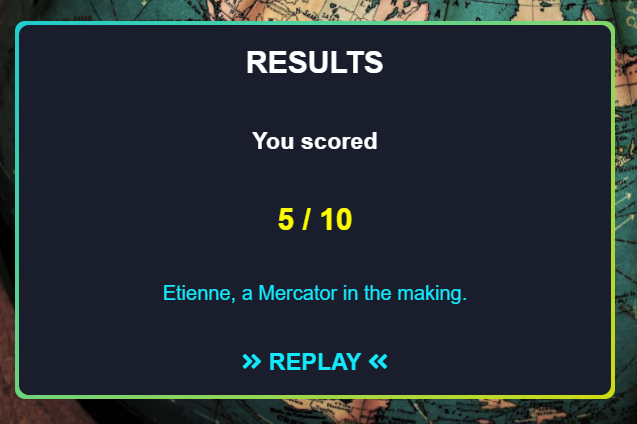

# **SCIENTIA geographia**

Welcome to **SCIENTIA geographia**. A website developed to Test your Geography knowledge.

 


# UX Design
The site is a fun but challenging quiz.
## Audience
It is target audience is assumed to have a good level of general knowledge or have studied geography as part of their academics.

## Site Design & User Stories
The site's design is informed by the *users stories* and aims to provide:
- An elegant yet simple and intuitive inteface
- A place to input a name to tailor their unique results
- Be able to discern what question they are on
- Have visual cue as to how much time is left to answer the current question
- Use a simple mouse click to select the answer to each question
- Provide the option to change their mind before moving to the next question
- Get feedback *during* the quiz on how they answered the previous questions
- At the end of the quiz to get a bespoke message on how they performed
- Have the option to play again
- Have a means of viewing the developer's other work and contacting them via LinkedIn

## Wireframing
[Wireframes](docs/wireframes) were created using Balsamiq desktop.


As the project developed other features were added to realise functionality. These included: 
- A call to action button to begin the quiz
- A name input section before the first question
- A replay button in the results section to easily navigate to the beginning of the page

## Color Scheme and Accessibility

The *color scheme* was derived from a piece of fabric passed through [Adobe Color](https://color.adobe.com/create/image-gradient)


To meet WCAG 2.0 criteria, the generated color scheme was then passed to [eightshapes.com](http://www.eightshapes.com) to generate an [*accessibility table*](docs/readme/color-contrast-grid.png "Color Accessibilty Table").


## Code Reusability & Site Layout
Extensive use was made off flexbox to position elements and were possible classes within the html was used to inject most of the CSS styles into the page.
This reduced the size and complexity of the CSS used.

```html
<section id="quiz" class="flex-column flex-center rounded-border max-width">
</section>
```

```css
.rounded-border {
border-radius: 10px;
}
```

# Existing Features

## One Page Site / Future Implementations
For ease, the site is limited to one page as this is my first time using Javascript (JS) within the DOM.  Given current limitations, I was still able to activate the page by showing/hiding different sections by adding event listeners to specific elements.
This gives the appearance of the site being more complex than it actually is.

```js
function startNewGame() {
  landingSection.style.display = "none";
  newGameSection.style.display = "inline-flex";
  playerName.focus();
}

playQuizButton.addEventListener("click", startNewGame);
```

Further development implementations can be a leaderboard, and an option for the user to change color scheme. JS can easily do this by adding/removing classes on targeted elements.

## Header & Background


The site follows a simple one page design therefore an anchor tag isn't required on the [header](docs/readme/header.png "Header section").

Also, no menus are needed as navigation is achieved using JS.

An alpha value of 0.85 is used to help blend the heading into the [*background*](docs/readme/background.png "Background Image") image attached to the body.  An old fashioned globe implicitly tells the user the site is geography based.

Note the use of Latin and two contrasting font styles, one modern and the other cursive.  This is to convey that Geography is a modern science grounded in knowledge built up over millennia.

## Footer


The [*footer's*](docs/readme/footer.png "Footer section") purpose is to provide access to the developers Github repos and LinkedIn profile via the favicon links.  These open in new tabs.
Their goal is to allow potential employers and other students to review or use the code to assist in their own projects. 

## Landing Section
This section is a launch point for the user and is minimalist by design.  The call to action button acts as a signpost to begin the quiz.


## Name Section
The name section has a few useful features:
- Autofocus on the name input element to save the user having to manually select.  This is expecially useful on mobile devices.
- Two buttons to either start or Leave quiz and go back to landing section
- An additional event listener on the input element for pressing enter on a keyboard or Go on a mobile device keypad.  This has the same result as Start quiz.
- An error handler that applies a red border to the input box in the event where no player name is provided.


## Quiz Section
### Quiz Info Bar
STILL TO COMPLETE


- question indicator
- countdown timer
- countdown bar
STILL TO COMPLETE add to features - question randomiser

### Question & Answers
STILL TO COMPLETE


### Score Tracker
STILL TO COMPLETE


### Results Section
STILL TO COMPLETE



# Testing

## Validator Testing
### HTML
HTML directly copied and pasted into offical [W3C Markup Validator](https://validator.w3.org/). 
- *11 warnings* for the [page](docs/readme/html-validator-results.png "Image of validated HTML for index.html") lacking heading elements within the sections.


### CSS
CSS directly copied and pasted into the offical [W3C Jigsaw Validator](https://jigsaw.w3.org/css-validator/).
- No errors found in the [CSS](docs/readme/jigsaw.png "Image of validated external CSS file") file.


### Javascript
JS directly copied and pasted into a [linter](https://www.jslint.com/) tool.
- *9 warnings* for the [page](docs/readme/linter-check.png "JS Linter Check")


## Lighthouse
99% performance for [desktop](docs/readme/lighthouse-desktop.png "Chrome Developer Tools desktop score") site.


74% performance for [mobile](docs/readme/lighthouse-mobile.png "Chrome Developer Tools mobile score") site.


# Deployment

The site was deployed to *GitHub* pages. The steps to deploy are as follows:
- In the GitHub repository, navigate to the *Settings* tab
- From the source section drop-down menu, select the Master Branch
- Once the master branch has been selected, the page will be automatically refreshed with a detailed ribbon display to indicate the successful deployment.

The live link can be found here - https://stevenweir038.github.io/Scientia-Geographia-Quiz/

## Local Deployment

In order to make a local copy of this repository, you can clone the project by typing the follow into your IDE terminal:
- `git clone https://github.com/StevenWeir038/Scientia-Geographia-Quiz.git`

Alternatively if using gitpod you can click [here](https://gitpod.io/#https://github.com/StevenWeir038/Scientia-Geographia-Quiz)

# Credits
Once more a special mention is reserved for my mentor [Tim Nelson](https://github.com/TravelTimN) for his inspiration and calming advice on my journey to becoming a developer.

Also I'd like to thank my fellow students and alumni at [Code Institute](https://codeinstitute.net/) for sharing their insights and approaches via Slack.

Special credit goes to [Britannica](https://www.britannica.com/quiz/50-capital-cities-at-random-quiz) which help be formulate an approach to my own project.

## Media
**Images**

Body background courtesy of [Teahub](https://www.teahub.io/viewwp/iRibmT_wallpaper-globe-antiques-map-globus/).
## Content


<br>
<br>
<br>
<br>
<br>
<br>
<br>
<br>
<br>
<br>
<br>


## Browsers
The site was developed and tested using Chrome.  It's also ran with no discernable issues on Firefox Developer Edition and Opera. 

## Fixed Bugs
Mobile *fixed header* obscured section links leading to a negative user experience.
Utilised a [css only solution](https://codepen.io/cferdinandi/pen/GRJvozN) `scroll-margin-top` to scroll 121px above the section links. Incidentially this is the height of the mobile fixed header + 10px of white background space.

```css
section[id] {
scroll-margin-top: 121px;    
}
```    

Email field validation can be bypassed by directly clicking the submit button or pressing enter. To fix this I added `required` to the end of input tag as below.

```html
<input id="email-field" type="email" name="user-email" placeholder="Email address"
            aria-label="Type your email address here" required>
```

For formatting purposes I wanted the video to fill 90% of the screen width at all times. Hard coding a value of 800px for the desktop rendered the iframe too large on a mobile screen.
At higher resolutions the `.video` class dimensions became [distorted](docs/readme/distorted_video.png) from standard 16:9 aspect ratio in plants section due to being within an `iframe`.


The dimension issue was by solved placing the iframe inside a `div`. The iframe was styled to fit the full height and width of the div which in turn had a `padding-top` value of 56.25%.  This was calcuated using the aspect ratio (9/16 = 0.5625).
Further testing showed the video container was exceeding the screen height due to the 90% container width. Ten percentage points were taken off using `padding-top: 46.25%;`. This gives an aspect ratio of 7.4/16.
Note there is an experimental CSS property called `aspect-ratio`. I could have replaced the [existing solution](docs/readme/responsive_iframe_solution.png "Code to create a responsive iframe") with `aspect-ratio: 7.4 / 16;`.  I opted not to as MDN indicates it is still experimental and I want to optomise browser support.


After entering a validated email address the user is directed to a formdump page indicating their success. They are automatically taken back to main site after a predefined amount of time using the following code snippet in the `head`.

```html
<meta http-equiv="refresh" content="5; url=index.html">
```

## Unfixed Bugs
[Mobile nav menu](docs/readme/mobile_nav.png) does not collapse after selecting link then focusing on other parts of page. The menu icon must be clicked again to uncheck the hidden checkbox.
A review of [Stack Overflow](https://stackoverflow.com/) suggests no known fix using CSS only and that JavaScript is required.


In the [formdump](docs/readme/formdump_redirect_counter.png "Image of formdump counter showing user no action is necessary") page, the timer to indicate the site is redirecting back to home requires Javascript to change it's value in `#counter` element.  This shows the user the site is active and that they don't need to take any action to go back to homepage.


