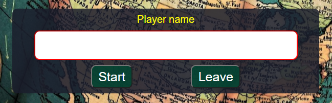

A MVP (minimally viable product) has been achieved given the development timeframe.


# Live Testing
Initial testing utilised **Chrome** as this is the primary browser/dev tool used on the Code Institute course.  When the project was almost finished I then viewed the results on other leading browsers including:

- Firefox Developer Edition
- Opera
- MS Edge

Some alterations were required for cross-browser consistency.

*Google Chrome*


*Firefox Developer Edition*


*Opera*


*Microsoft Edge*


## Known Bugs and Fixes

### Name Input
**Issue 1**

Users could proceed to quiz without entering their name. An error handler applies a red border to the input box in the event where no player name is provided.



### Countdown Bar
**Issue 1**

**On all browsers the countdown bar did not stand out as well as intended.** It was light blue in keeping the initial site color theme.

To add value to the user's experience, a color change was triggered using JS as time ran out from green to yellow to red.
In addition to better contrast, this adaptation adds a sense of panic to answer the each question.

``` JS
    if (timeLeft >=20) {
      timeLeftBar.style.backgroundColor = "green";
    } else if (timeLeft <= 10) {
      timeLeftBar.style.backgroundColor = "red";
    } else {
      timeLeftBar.style.backgroundColor = "yellow";
    }
```


**Issue 2**

**After applying the upgrade, the default light blue theme color reverted back everytime the timer reset to 30 seconds.**

This was overidden directly from `style.css` by changing the background color property of the `#time-left` element from `background-color: rgba(var(--theme-one), 0.85);` to  `background-color: green;`. 

An alternative solution would have been to change the property from the resetTimer() function directly from *script.js* using `timeLeftBar.style.backgroundColor = "green";`.

**Issue 3**

**As the timer ran down the countdown bar's movement appeared sticky.**

To make it appear more fluid, `transition: all 0.5s ease-in-out;` was added to the `#time-left` element in *style.css*

### Quiz Responsiveness
**Issue 1**

**On lower resolutions elements used in the quiz are hidden**

When testing responsiveness down to 320px width there wasn't enough room on the screen for all elements.
It's undesirable to make the users scroll. 
This became an issue at approximately 465px and was overcome by:
- hiding the header and footer elements when the quiz was in progress and reducing the margin of the `quiz-info-top` section.
- changing text in `question-number` element from Question to Q.
- adding a media query to hide the paragraph element on the header on resolution below 768 pixels.

### Score tracker
**Issue 1**

**The score tracker feature gives immediate feedback during the quiz.**

The user could initially see if their answer was incorrect providing an opportunity to change their selection.
To prevent such dishonesty the score tracker updated only when moving onto the next question.
In the code, this was achieved by calling `trackerUpdate()` only from the `nextQuestion()` function.

**Issue 2**

**Score tracker child elements not defaulting to gray color for previous unanswered question**

The click event on an answer element sets the `yaynay` variable value to `"correct"` or `"incorrect"` using the `evaluateAnswer()` function. This is the only means to assign these values to the `yaynay` variable.

On each new question it was necessary to default the `yaynay` value to `"unanswered"` after changing the previous questions element color. This is dependant on the switch case in `trackerUpdate()` as shown by `document.getElementsByClassName("circle")[questionCount - 1].style.backgroundColor = trackerColor;`.

In the code, this works as `trackerUpdate()` is exclusively called from the `nextQuestion()` function.

A user will likely not notice the above logic as it is assumed they will make an effort to answer each question before 
moving on, even if they are unsure of the answer.  As a developer, I must account for all behaviours.

### Results

**Issue 1**

**On Firefox and Opera the `#results::before` pseudo-element was distracting by 'cutting off' at the corners.**

This was used to show a rotating animation that displayed only on the border.  The width and height of the `#results::before` pseudo-element needed to be increased on the already hidden overflow.
By playing with the bug I stumbled on a better effect across all browsers displaying a constant but dynamic border color change.

**Issue 2**

**A square interior corner on the border.**

This was solved by changing the border radius property on the after pseudo-element `#results::after`to:

``` css
  inset: 4px;
  border-radius: 10px;
```

## Unfixed Bugs
All known bugs have been addressed.  Please provide feedback to those I may have missed to improve the application.

## Validator Testing
### HTML
HTML directly copied and pasted into offical [W3C Markup Validator](https://validator.w3.org/). 
- *0 errors, 13 warnings* for the [page](docs/readme/html-validator-results.png "Image of validated HTML for index.html") lacking heading elements within the sections and aria label usage.


### CSS
CSS directly copied and pasted into the offical [W3C Jigsaw Validator](https://jigsaw.w3.org/css-validator/).
- *0 errors, 29 warnings* found in the [CSS](docs/readme/jigsaw.png "Image of validated external CSS file") file.


### Javascript
JS files directly copied and pasted into a [linter](https://jshint.com/) tool.
1st file was *questions.js*


2nd file was *script.js*


### Lighthouse
99% performance for [desktop](docs/readme/lighthouse-desktop.png "Chrome Developer Tools desktop score") site.


92% performance for [mobile](docs/readme/lighthouse-mobile.png "Chrome Developer Tools mobile score") site.


[Return to README.md](README.md)