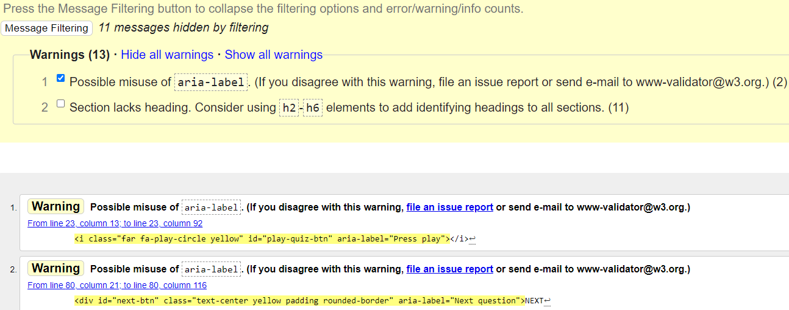
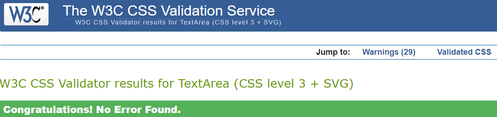
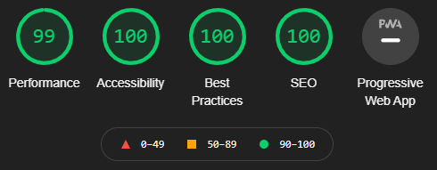

  - [Fixed Bugs](#fixed-bugs)
  - [Unfixed Bugs](#unfixed-bugs)
  - [Browsers](#browsers)
  - [Validator Testing](#validator-testing)
    - [HTML](#html)
    - [CSS](#css)
    - [Javascript](#javascript)
    - [Lighthouse](#lighthouse)

    # Testing
## Fixed Bugs
- Shuffle functionality added to quiz before beginning using Fisher/Yates method.  This way we can always ask the same number of questions but 
improve their variation in the case the user plays more than once.
- User could proceed to quiz without entering text into playerName input
- Score Tracker displayed correct/incorrect answer before user moved onto next question.  This gave the oppurtunity to cheat.
- Syncing the countdown bar with the countdown timer element.
- Once the countdown bar upgrade was applied with the following code the default light blue theme color reverted back everytime the timer reset to 30 seconds.

``` JS
    if (timeLeft >=20) {
      timeLeftBar.style.backgroundColor = "green";
    } else if (timeLeft <= 10) {
      timeLeftBar.style.backgroundColor = "red";
    } else {
      timeLeftBar.style.backgroundColor = "yellow";
    }
```
This was fixed by changing the background color of the `#time-left` element in *style.css* from `background-color: rgba(var(--theme-one), 0.85);` to  `background-color: green;` to match the color attributes being applied by the JS. Alternatively I could have applied directly from the JS resetTimer() function by adding `timeLeftBar.style.backgroundColor = "green";`.

- A further modification was made to the countdown bar to make it's movement appear more fluid by adding `transition: all 0.5s ease-in-out;` to the `#time-left` element in *style.css*

- If the user did not select an answer within 30 seconds the quiz moves onto the next question. The score tracker for the previous question should then default to a gray color.

If any previous question was answered then the click event on an answer element set the `yaynay` variable value to *correct* or *incorrect* using the `evaluateAnswer()` function. Note `evaluateAnswer()` is only called from a click event on an answer element making it the only means to assign the about two values to the `yaynay` variable.

To default the previous questions status to *unanswered (and therefore set the previous question indicator to a gray color)*, the following was added at the end of the `trackerUpdate()` function.  Therefore if the quiz is left idle *(at any point)* then the correct indicator of red/green/gray shold always be displayed.

``` JS
  document.getElementsByClassName("circle")[questionCount - 1].style.backgroundColor = trackerColor;
    yaynay = "unanswered";
```

Notably a user will likely not notice the above logic as it is assumed they will make an effort to answer each question before 
moving on, even if they are unsure of the answer.  As a developer we have to try to account for every behaviour however.

## Unfixed Bugs
All known bugs have been addressed.  Please provide feedback to those I may have missed to improve the application.

## Browsers
STILL TO COMPLETE

## Validator Testing
### HTML
HTML directly copied and pasted into offical [W3C Markup Validator](https://validator.w3.org/). 
- *11 warnings* for the [page](docs/readme/html-validator-results.png "Image of validated HTML for index.html") lacking heading elements within the sections.



### CSS
CSS directly copied and pasted into the offical [W3C Jigsaw Validator](https://jigsaw.w3.org/css-validator/).
- No errors found in the [CSS](docs/readme/jigsaw.png "Image of validated external CSS file") file.



### Javascript
JS directly copied and pasted into a [linter](https://www.jslint.com/) tool.
- *9 warnings* for the [page](docs/readme/linter-check.png "JS Linter Check")


### Lighthouse
99% performance for [desktop](docs/readme/lighthouse-desktop.png "Chrome Developer Tools desktop score") site.



74% performance for [mobile](docs/readme/lighthouse-mobile.png "Chrome Developer Tools mobile score") site.


